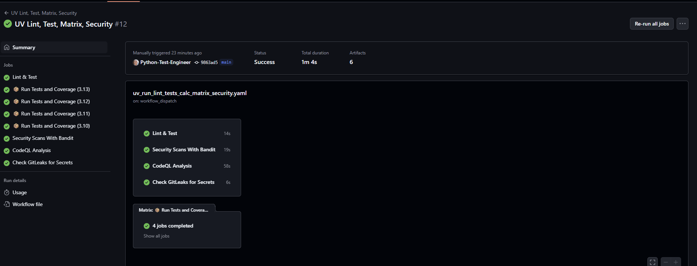
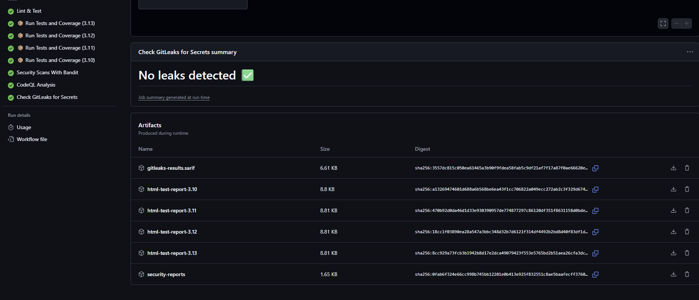
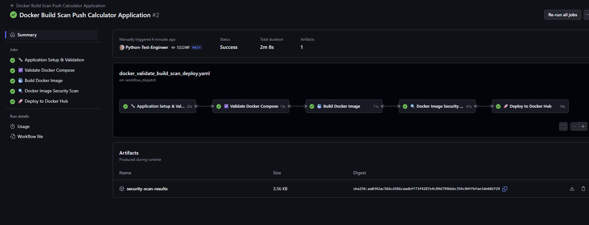

# Python Code Quality & Security Implementation Guide

## Overview
This document provides a comprehensive plan for implementing code quality, typing, and security checks for Python projects using GitHub Actions, from local development through CI/CD deployment.

## Local Development (Pre-commit)

### Pre-commit Hook Configuration

- Precommit hooks built in
    - id: trailing-whitespace
    - id: end-of-file-fixer
    - id: check-yaml
    - id: check-added-large-files
    - id: check-merge-conflict
    - id: debug-statements

- id: pyright Pyright is a powerful, fast, and feature-packed static type checker explicitly designed for Python. It helps to ensure code quality, catch errors early, and boost productivity through static type checking.
- id: ruff-check linter
    args: [--fix]
- id: ruff-format
- id: conventional-pre-commit  ensures commit message is standardised
  - stages: [commit-msg]
- id: python-script LEAK DETECTION CUSTOM
    - **enables easy dev change if needed.**
    - name: Python Script
    - entry: python custom.py
    - language: python
    - stages: [pre-commit]
    - *We can add other checks here if needed*
- id: bandit

### Conventional Commit Messages

- This provides structure around what has been committed and can be used for versioning.

## CI/CD Pipeline (GitHub Actions)

### Build Matrix Strategy
- Set up matrix testing across Python versions (3.9, 3.10, 3.11, 3.12).
- Test across Ubuntu only.
- Install dependencies with caching for faster build times.
- Download Pytest-HTML reports.

### Code and Security Quality Checks

- Run Ruff, MyPy/Pyright, Unit tests/Coverage, CodeQL, Bandit, Safety,Pip-audit in CI
- Scan for secrets and credentials in commit history and codebase
- Check for dependency vulnerabilities with GitHub's dependency review TO DO

### Docker

We use Trivy and Docker Scout, inbuilt in GitHub Actions, to scan Docker images for vulnerabilities and secrets, with a downloadable report.

We can run matric Python version for the Dockerfile using arguments: --build-arg PYTHON_VERSION=3.9 etc `02_CI/DockerfileMultiple` and `02/cicd_pipeline.yaml`.
