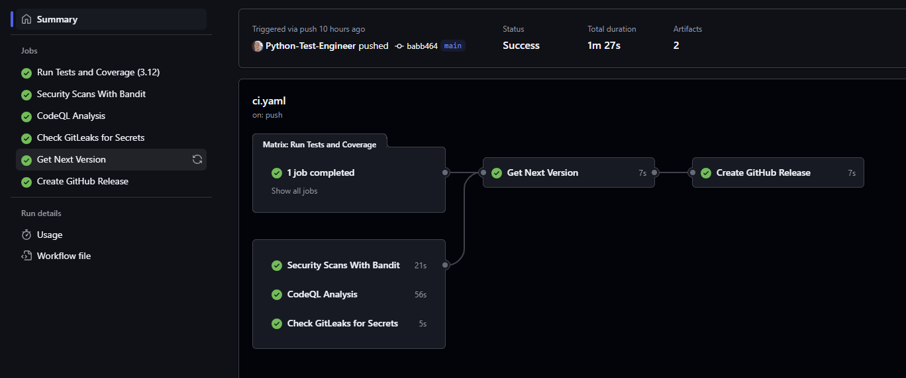

# What?

This is an MVP of a CI/CD pipeline for a Python package using GitHub Actions that use the `pre-commit` hook to check for common issues and linting errors as well as ensuring `conventional commits` are used to commit changes to the repository.

These take the form of `feat: <message>` etc that enable semantic versioning to be used dynamically.

Commits cannot be made if the commit message does not follow a predefined format.

# How?

GitHub Actions carry out the following tasks:

1. Run Tests.
2. Run security checks with Bandit.
3. Run CodeQL for security checks and vulnerabilities.
4. Check for secrets with Gitleaks.
5. Gets the next version number based on semantic versioning.
6. Dyanamically create a release based on this new version.

# Set up

The most important thing is that the current release version is set in `pyproject.toml`.

The version is statically set. If you change to dynamic versioning you will need to update the `version` in `pyproject.toml` and the `__version__` in `src/calculator/__init__.py`.

If you have diffuclty with end of line formating even if you have avoided trailing spaces, you can either comment out this in the `pre-commit-config.yaml` or use `git rm -rf --cache .` to remove the pre-commit cache and then run the add and commit again.

`uv sync` will install all dependencies from the lock file.

`.\venv\Scripts\activate` will activate the virtual environment.

# TO DO

- Add the ability for CHANGELOG.md to be updated dynamically.
- Deploy details to AWS etc.
- Refactor `.github/workflows/ci.yml` to use reuseable workflows.
